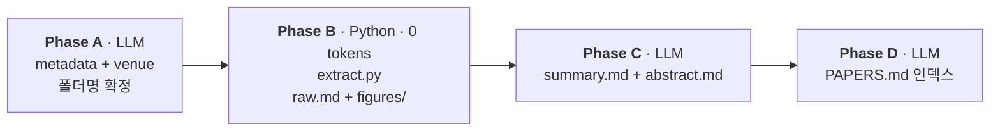

# paper-summary

> 논문 PDF 를 **사람이 쉽게 이해·서치·재독할 수 있는 3 파일**로 나눠 정리하는 [Claude Code](https://docs.anthropic.com/en/docs/claude-code) skill.

[](LICENSE)


## 철학

연구실에 논문은 계속 쌓인다. 한 편을 제대로 쓰려면:

1. **PDF 원문을 자동 추출기로 뽑는다** — Python (PyMuPDF) 이 본문 + figure 까지 긁어 `raw.md` 로 저장. LLM 토큰 0.
2. **LLM 이 그 원문을 사람이 이해하기 쉬운 형태로 요약**한다 — `summary.md` (수식 · Table · figure embed 포함 상세 요약) 와 `abstract.md` (메타 + 초록 + 한글 번역).

이렇게 만들어진 **3 파일은 각자 다른 용도**다.

| 파일 | 언제 쓰나 |
|------|-----------|
| **`summary.md`** ★ | **사람이 메인으로 읽는 파일.** 논문을 제대로 이해하거나, 향후 연구에 새로운 관점을 얻고 싶을 때 가장 먼저 연다. |
| **`abstract.md`** | 논문이 수십·수백 편 쌓였을 때 **LLM 에게 "이 중에서 X 와 관련된 거 찾아줘" 를 빠르게 시킬 때**의 index. |
| **`raw.md`** | summary 만 보고 이해가 안 될 때 참조하는 **원문 백업**. 사람은 평소에 안 연다. |

figure 는 `figures/figN.png` (main) 과 `figures/figAN.png` (appendix) 로 크롭 저장되고 `summary.md` 안에 embed 되어 있다. `figures/_pages/p-NN.png` 는 200dpi 페이지 원본으로, 자동 크롭이 실패한 경우 수동 재크롭용.

## 흐름



Phase 순서가 중요하다 — **폴더명을 Phase A 에서 먼저 확정**해서 Phase B 가 정확한 경로에 쓰도록. `_tmp1` 같은 임시 이름을 거쳐 나중에 rename 을 까먹는 실수를 원천 차단.

## Examples

실제 논문 2 편을 이 skill 로 정리한 결과가 [`examples/`](examples/) 에 있습니다.

- **[MELON (ICML 2025)](examples/1_zhu2025MELON%28ICML2025%29/)** — IPI 공격에 대한 masked re-execution 기반 방어.
  - [`abstract.md`](examples/1_zhu2025MELON%28ICML2025%29/abstract.md) (메타 + 번역)
  - [`summary.md`](examples/1_zhu2025MELON%28ICML2025%29/summary.md) (전체 사실 요약, figure embed 포함)
- **[ChatInject (ICLR 2026)](examples/2_chang2026ChatInject%28ICLR2026%29/)** — Chat format 기반 prompt injection.
  - [`abstract.md`](examples/2_chang2026ChatInject%28ICLR2026%29/abstract.md)
  - [`summary.md`](examples/2_chang2026ChatInject%28ICLR2026%29/summary.md)

## Install

```bash
git clone https://github.com/wj926/paper-summary.git ~/.claude/skills/paper-summary
pip install pymupdf
```

새 Claude Code 세션을 열면 `paper-summary` 가 skill 목록에 자동 등록됩니다.

## Use

Claude Code 세션에서 자연어로:

```
이 PDF paper-summary 로 정리해줘: /path/to/paper.pdf
```

Claude 가 Phase A→B→C→D 를 순서대로 실행합니다.

### Python 직접 실행

`extract.py` 자체는 독립 스크립트라 Claude 없이도 돌릴 수 있어요.

**PDF metadata 만 빠르게 확인** (Phase A 에서 폴더명을 사람이 정할 때 유용):

```bash
python3 scripts/extract.py --metadata-only path/to/paper.pdf
# title=... / author=... / pages=... / arxiv=... / first_page_head=...
```

**전체 추출** (raw.md + figures/):

```bash
python3 scripts/extract.py path/to/paper.pdf path/to/out_dir/
```

## 폴더명 규칙

```
<N>_<firstauthor><year><METHOD>(<venue><year>)
```

| field | 규칙 | 예시 |
|-------|------|------|
| `<N>` | 프로젝트 내 추가 순서 (1 부터) | `1` |
| `<firstauthor>` | 제1저자 성, 소문자 | `zhu` |
| `<year>` | 논문 연도 | `2025` |
| `<METHOD>` | 핵심 알고리즘 / method (acronym 은 대문자) | `MELON`, `KLASS` |
| `<venue><year>` | 학회 약어 + 연도. preprint 는 `preprint`. Oral/Spotlight 는 suffix | `ICML2025`, `NeurIPS2025`, `ICLR2026-Spotlight` |

예: `1_zhu2025MELON(ICML2025)`

arXiv PDF 에 학회 표기가 없으면 Phase A 에서 Google 로 논문 제목을 검색해 accept 된 학회를 먼저 확인합니다. 확인되지 않으면 `preprint`.

## Phase C 가 따르는 원칙 (요약)

자세한 건 [`references/summary_rules.md`](references/summary_rules.md).

- 수치·수식·저자명·연도는 `raw.md` 원문 그대로. 기억·감으로 변형하지 않는다.
- 논문에 없는 새 용어를 만들어 쓰지 않는다 (Claude 조어 금지).
- 수식은 display math (`$$...$$`) + Notation / Per-term blockquote 위계.
- Figure 는 해당 Section 안에 embed + 3 줄 주석 (저자 주장 / 직관적 해석 / 본문 언급).
- `summary.md` 는 사실 기반만. "우리 연구와의 연결 / 활용 전략 / 심층 분석" 은 이 skill 범위 밖 — 향후 별도 `paper-analyze` skill 로 분리 예정.

## 파일 구조

```
paper-summary/
├── README.md                  # 이 문서
├── LICENSE                    # MIT
├── SKILL.md                   # Claude agent 가 따르는 오케스트레이션
├── scripts/
│   └── extract.py             # Phase A metadata / Phase B 추출
├── templates/
│   ├── summary.md             # Phase C long-form placeholder
│   └── abstract.md            # Phase C short-view placeholder
├── references/
│   └── summary_rules.md       # Phase C 작성 규칙 세부
└── examples/
    ├── 1_zhu2025MELON(ICML2025)/
    └── 2_chang2026ChatInject(ICLR2026)/
```

## 의존성

- Python 3.10+ with [PyMuPDF](https://pymupdf.readthedocs.io/) (`pip install pymupdf`)
- [Claude Code](https://docs.anthropic.com/en/docs/claude-code) — Phase A / C / D 진행

## 한계

- **OCR 불가**: PDF 에 text layer 가 있어야 합니다. 스캔본·이미지 PDF 는 별도 OCR 선행 필요.
- **Figure 크롭 휴리스틱**: caption 위의 embedded image + vector drawing bbox 를 union 한 뒤 텍스트 블록으로 top clamp 하는 방식. 드물게 실패할 수 있고, 그 경우 `figures/_pages/p-NN.png` 에서 수동 크롭. `raw.md` 의 Figure index 에 ⚠ 로 표시됩니다.
- **Non-English 논문**: 추출 자체는 되지만 Glossary / 한글 번역 품질이 떨어질 수 있습니다.

## License

[MIT](LICENSE)
