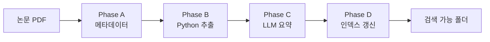

<!-- _class: title -->
<!-- _paginate: false -->

# paper-summary 스킬<br>동작 원리

<div class="author">Woojin Lee<br>Dongguk University</div>
<div class="date">2026.04.24</div>

---

<!-- _class: toc -->

# Contents

1. Why: 왜 이 스킬이 필요한가
2. 구조: 4 Phase 파이프라인
3. 핵심 설계 원칙
4. 산출물 레이아웃과 작성 규칙
5. 비용·시간 실측과 사용 예시

---

<!-- _class: section -->

# 1. Why: 왜 이 스킬이 필요한가

---

# 문제 의식

## 상황

- 연구실 한 프로젝트당 관련 논문이 **수십 편** 쌓인다
- 같은 논문을 여러 번 다시 읽게 되는데 매번 PDF 를 새로 연다
- 사람마다 요약 방식이 달라서 **일관성**이 없고, 수식·수치가 기억·감으로 변형됨

## 기존 방식의 문제

- PDF 재독은 비용이 큼 (모델에게 PDF 를 반복 파싱시키면 토큰 낭비)
- 손으로 쓴 요약은 hallucination 검증이 어려움
- figure 는 텍스트로만 요약돼 시각 맥락을 잃음

<div class="callout">

**핵심 판단**: 논문을 처음 읽을 때 딱 한 번만 비싸게 정리하고, 이후에는 같은 파일을 계속 재사용하는 구조가 필요하다.

</div>

---

# 3 파일로 쪼갠 이유

## 개요

- 논문을 어떻게 열람하느냐에 따라 **필요한 정보량이 다르다**
- 짧은 서치·Q&A·원문 검증의 세 가지 시나리오를 각자 다른 파일로 분리
- 파일마다 생성 주체와 비용이 다르게 설계됨

| 파일 | 언제 열어봄 | 생성 주체 | 분량 |
|------|-------------|-----------|------|
| `abstract.md` | 서치 중 관련성만 빠르게 판단 | LLM (Phase C) | 짧음 (1–2KB) |
| `summary.md` | Q&A / 논의의 **1차 소스** | LLM (Phase C) | 긴 상세 (20–40KB) |
| `raw.md` | summary 에 빠진 게 있을 때만 | Python (Phase B) | 원문 전체 (40–80KB) |

<div class="callout">

**역할 분리 = 관심사 분리**. 요약 실수가 나도 `raw.md` 로 원문 재확인 가능, PDF 를 다시 열 필요가 없다.

</div>

---

<!-- _class: section -->

# 2. 구조: 4 Phase 파이프라인

---

# 파이프라인 전체 흐름

## 구조

- Phase A, B, C, D 순서로 엄격하게 진행
- `_tmp` 같은 임시 이름을 거치지 않도록 **폴더명을 Phase A 에서 먼저 확정**
- LLM 호출은 A 와 C 뿐, B 는 Python 이라 **토큰 0**



<div class="callout">

폴더명을 맨 앞에서 확정. 추출물이 제 위치에 바로 떨어지게 하기 위함.

</div>

---

# Phase A: 메타 + 폴더명 확정

## 역할

- PDF 에서 제목·저자·arXiv ID·첫 페이지 헤더를 뽑는다
- venue 가 불확실하면 **Google 검색**으로 학회 accept 여부 확인
- 폴더명을 지금 확정해서 Phase B 출력 경로로 바로 전달

## 폴더명 규칙

- 형식: `<N>_<firstauthor><year><METHOD>(<venue><year>)`
- 예: `1_zhu2025MELON(ICML2025)`, `2_kim2025KLASS(NeurIPS2025)`
- `<N>` 은 프로젝트 `papers/` 아래 추가 순서, BibTeX key 와 일치
- Oral/Spotlight 면 suffix: `(ICLR2026-Spotlight)`

<div class="callout">

폴더 이름만 봐도 **논문 식별 + 중요도 + 순번**이 다 드러난다. `ls papers/` 한 번이면 프로젝트 구성 파악 가능.

</div>

---

# Phase B: Python 추출 (토큰 0)

## 역할

- PyMuPDF (`fitz`) 로 PDF 를 파싱해서 page 별 텍스트 추출
- figure caption 위치를 잡고, 주변 image/vector drawing 박스를 union 해서 **figure 자동 크롭**
- 200dpi 페이지 전체도 함께 렌더 (크롭 실패 시 수동 재크롭용)

<div class="flow-row">

<div class="flow-box">
<div class="header">Input</div>
<div class="body">

- PDF 경로
- 확정된 out_dir

</div>
</div>

<div class="flow-box">
<div class="header">Process</div>
<div class="body">

- 페이지 텍스트
- caption regex
- bbox union

</div>
</div>

<div class="flow-box">
<div class="header">Output</div>
<div class="body">

- `raw.md`
- `figures/figN.png`
- `figures/_pages/`

</div>
</div>

</div>

<div class="callout">

이 단계는 **LLM 을 전혀 쓰지 않는다**. 수십 페이지 PDF 도 수 초면 끝나고, 비용은 전기료뿐.

</div>

---

# Phase C: LLM 요약

## 입력

- Phase B 가 만든 `raw.md` (논문 전문 + figure embed + boundary 정보)
- `references/summary_rules.md` (작성 규칙 모음)
- `templates/summary.md`, `templates/abstract.md` (구조 placeholder)

## 출력

- `summary.md`: 메타 + TL;DR + Glossary + Section 별 상세 + Figure 주석 + Table
- `abstract.md`: 메타 + Abstract 원문 + 한글 번역 (summary 의 앞부분 복제)

| 섹션 | summary | abstract |
|------|---------|----------|
| 메타데이터 / BibTeX | ✅ | ✅ (동일 문구) |
| Abstract 원문 + 번역 | ✅ | ✅ (동일 문구) |
| TL;DR / Glossary / Section 별 | ✅ | — |
| Figure 주석 / Table / 수식 | ✅ | — |

---

# Phase D: PAPERS.md 인덱스

## 역할

- 프로젝트 루트의 `PAPERS.md` 표에 새 논문 한 행을 추가
- 폴더 링크 + 카테고리 + 한 줄 핵심 연결점 세 칸만 채움
- 다음 논문 정리 시 자연스럽게 `<N+1>` 을 이어가게 됨

## 왜 별도 Phase 인가

- 단일 논문 폴더 안의 정보만으로는 **프로젝트 전역 검색**이 어렵다
- `PAPERS.md` 가 논문 간 관계의 진입점 역할
- `grep` 한 번으로 카테고리·저자·연도 조회 가능

<div class="callout">

`PAPERS.md` 는 **사람이 읽는 index**. 다음 회의 때 「이 논문 뭐였지」 를 여기서 먼저 찾는다.

</div>

---

<!-- _class: section -->

# 3. 핵심 설계 원칙

---

# 원칙 1: Phase 별 역할 분리

## 개요

- Phase A 는 **결정**을 LLM 에게 맡긴다 (venue, 폴더명)
- Phase B 는 **기계적 파싱**을 Python 에게 맡긴다 (토큰 0)
- Phase C 는 **판단+글쓰기**를 LLM 에게 맡긴다 (요약)
- Phase D 는 **단순 편집**을 LLM 에게 맡긴다 (인덱스 한 줄)

| Phase | LLM 필요성 | 이유 |
|-------|-----------|------|
| A | 낮음–중 | venue 확인이 흔들릴 수 있음, 폴더명 규칙 적용 |
| B | 없음 | PDF → text/figure 는 결정론적 작업 |
| C | 높음 | 수식·서사 요약은 자연어 판단 필요 |
| D | 낮음 | 표 한 줄 추가, Python 스크립트로도 가능 |

<div class="callout">

LLM 을 할 수 있는 곳에 다 쓰지 않고, **꼭 필요한 곳에만** 쓴다.

</div>

---

# 원칙 2: Hallucination 제로

## 규칙

- 수치 / 인용 / 수식 / 저자명 / 연도는 **raw.md 원문 그대로**, 기억·감으로 변형 금지
- 확신 없으면 `raw.md 에 명시 없음` 으로 남기고 넘어간다
- 주장·해석할 때 **출처 명시**: `raw.md p. 5`, `Eq. 7`, `Fig 3 caption` 식

## 왜 이게 중요한가

- LLM 은 비어 있는 슬롯을 그럴듯한 값으로 채우려는 경향이 있음
- 요약이 한 번 틀리면 이후 Q&A 에서 **틀린 근거로 계속 참조**됨
- 원문 복귀가 쉬우려면 `raw.md` 와 `summary.md` 의 수치가 일치해야

<div class="callout">

요약의 1차 가치는 **압축이 아니라 정확한 재현**이다. 압축은 부산물.

</div>

---

# 원칙 3: Claude 조어 금지

## 개요

- 논문에 없는 **새 용어를 만들어 쓰지 않는다**
- 볼드·따옴표로 새 명사처럼 꾸미는 것도 금지
- 대신 논문 Glossary 용어 또는 확립된 일반 ML 용어만 사용

<div class="cols-2">

<div>

**BAD**

- **"지식 누수 게이트"** 라는 메커니즘으로 제어
- 저자는 **"양방향 reasoning"** 을 주장
- 이는 **"self-corrective decoding"** 의 핵심

</div>

<div>

**GOOD**

- 특정 토큰에서 leakage score 로 제어 (Eq. 4)
- 저자는 bidirectional context 를 활용 (§ 3.2)
- denoising step 에서 재샘플링 (Alg 1)

</div>

</div>

<div class="callout">

요약자가 새 용어를 만드는 순간, 다음 독자는 **그 용어가 논문 것인지 요약자 것인지** 알 수 없어진다.

</div>

---

# 원칙 4: 폴더명이 곧 식별자

## 형식

- `<N>_<firstauthor><year><METHOD>(<venue><year>)`
- BibTeX key 와 자연스럽게 매핑: `kim2025KLASS` ↔ `@inproceedings{kim2025klass, ...}`
- `PAPERS.md` 인덱스 번호와 일치

## 얻는 것

- `ls papers/` 한 번이면 프로젝트 전체 논문 목록과 중요도·순번이 드러남
- `grep -r "kim2025KLASS"` 로 프로젝트 내 인용 추적 가능
- 새 논문 추가 시 다음 번호가 자명

<div class="callout">

파일 시스템이 곧 **카탈로그**. 별도 DB 나 메타데이터 파일이 필요 없어진다.

</div>

---

<!-- _class: section -->

# 4. 산출물 레이아웃과 작성 규칙

---

# 세 파일 비교

## 개요

- 같은 논문의 세 가지 뷰, 길이·생성비용·용도가 모두 다름
- `raw.md` 는 원문 복원 가능한 상태, `summary.md` 는 재해석 가능한 상태, `abstract.md` 는 관련성 판별용

| 파일 | 포함 | 주요 쓰임새 | 토큰 비용 |
|------|------|------------|-----------|
| `raw.md` | 페이지별 전문 + figure embed + boundary | 요약 누락 시 원문 확인 | 0 (Python) |
| `summary.md` | 메타 / TL;DR / Glossary / Section / Figure / Table | Q&A · 논의의 1차 소스 | 중 |
| `abstract.md` | 메타 + abstract 원문 + 번역 | 서치할 때 빠른 판단 | 낮음 |

<div class="callout">

세 파일 **중 어느 하나만으로는 부족**하도록 일부러 설계. 각자 다른 시나리오에 최적화.

</div>

---

# Figure 작성 규칙

## 개요

- Phase B 가 `figures/figN.png` 로 크롭, Phase C 가 **Section 내부에 embed + 3줄 주석**
- main / appendix 모두 본문에 등장한 곳에 embed (인덱스에만 두고 누락 금지)
- 경로 규칙: main 은 `figN.png`, appendix 는 `figAN.png`

<div class="flow-row">

<div class="flow-box">
<div class="header">저자 주장</div>
<div class="body">논문 § X.X 의 사실 기반 주장, 저자가 이 figure 로 무엇을 보이려 했는가</div>
</div>

<div class="flow-box">
<div class="header">직관적 해석</div>
<div class="body">왜 이 배치여야 하는지, 논문 주장 범위 내에서만, 새 아이디어 금지</div>
</div>

<div class="flow-box">
<div class="header">본문 언급</div>
<div class="body">raw.md 에서 Fig N 을 인용한 모든 위치 + 그때의 주장 요약</div>
</div>

</div>

---

# 수식 작성 규칙

## 개요

- 짧은 기호·변수만 인라인, **한 줄 이상이면 무조건 display math**
- 본문 수식은 누락 없이 전부 옮긴다 (appendix 는 선택)
- 각 수식 아래에 한국어 주석 한 줄 + Notation / Per-term 블록

```markdown
#### 샘플링 목적 함수

$$\mathcal{L}(x) = \mathbb{E}_{t,\epsilon}
  \big[ w(t) \cdot \| \epsilon_\theta(x_t, t) - \epsilon \|^2 \big]$$

> 노이즈 예측 오차에 시간 가중 w(t) 를 곱해 평균.

> **Notation**
> - $x_t$: 시각 t 의 노이즈 있는 샘플
> - $\epsilon_\theta$: 학습 모델의 노이즈 예측
>
> **Per-term**
> - $w(t)$: SNR 기반 가중, 고노이즈 영역 강조
```

---

<!-- _class: section -->

# 5. 비용·시간 실측과 사용 예시

---

# Phase 별 토큰·시간 실측

## 개요

- Phase B 는 토큰 0, Phase A/C 만 LLM 비용 발생
- Phase C 가 전체 비용의 90% 이상 차지 (긴 raw.md 입력 + 긴 summary 출력)
- 시간은 Phase C 의 생성 지연이 지배적

| Phase | 입력 토큰 | 출력 토큰 | 소요 시간 | 비고 |
|-------|----------|----------|----------|------|
| A 메타 + venue | 1–3K | 0.5–1K | 30–60s | web search 포함 시 상단 |
| B Python 추출 | 0 | 0 | 5–15s | 페이지 수에 비례 |
| C 요약 | 25–40K | 10–15K | 2–5min | raw.md 크기가 지배 |
| D 인덱스 | 2–3K | 0.2K | 10–20s | 한 줄 편집 |

<div class="callout">

총계 약 **30–45K in / 11–16K out, 3–7분**. 한 번 돌면 같은 논문은 다시 돌릴 이유가 없다.

</div>

---

# 모델별 논문 1편 비용

## 개요

- 위 토큰 수치를 모델 pricing 에 곱한 값 (2026 기준)
- Sonnet 4.6 은 가성비, Opus 4.7 은 요약 품질이 필요한 중요 논문용
- 실측 범위라 논문 분량·figure 수에 따라 ±30% 변동

| 모델 | 입력 단가 | 출력 단가 | 논문 1편 비용 |
|------|----------|----------|---------------|
| Claude Sonnet 4.6 | $3 / M | $15 / M | **약 $0.25–0.40** |
| Claude Opus 4.7 | $15 / M | $75 / M | **약 $1.20–1.80** |
| Claude Haiku 4.5 | $1 / M | $5 / M | 약 $0.10–0.15 |

<div class="callout">

프로젝트당 20–30편 정리해도 Sonnet 기준 **$5–12** 수준. PDF 재독을 반복하는 비용보다 훨씬 싸다.

</div>

---

# 실제 사용 흐름

## 개요

- 논문 PDF 를 프로젝트 `papers/` 에 넣고 스킬을 호출하기만 하면 됨
- Phase A 에서 폴더명을 확정하고, Phase B 가 자동으로 추출, Phase C 가 요약을 생성
- 사용자는 venue 확인 단계에서 한 번, 완성된 요약 검토에서 한 번 개입

```bash
# Phase A: 메타데이터 확인
python3 ~/.claude/skills/paper-summary/scripts/extract.py \
  --metadata-only paper.pdf

# Phase B: Python 추출 (확정된 out_dir 로)
python3 ~/.claude/skills/paper-summary/scripts/extract.py \
  paper.pdf papers/3_li2026METHOD\(ICLR2026\)/

# Phase C/D, LLM 이 템플릿 따라 summary/abstract 작성 + PAPERS.md 갱신
```

<div class="callout">

스킬 호출은 **`paper-summary 로 이 PDF 정리해줘`** 한 줄이면 충분. Phase A–D 는 자동 진행.

</div>

---

# 스킬 경계와 확장

## paper-summary 가 하는 것

- 논문을 **사실 기반**으로 정리한 세 파일 생성
- figure 자동 크롭 + Section 내부 embed
- 프로젝트 인덱스 유지

## paper-summary 가 하지 않는 것

- 우리 연구와의 연결 / 활용 전략 / 심층 해석
- figure 의 관점 기반 재해석
- 논문 간 관계도 그리기

<div class="callout">

해석·관점 작업은 별도 **paper-analyze** 스킬 담당. 같은 폴더의 `discussion.md` 에 날짜별로 누적되는 구조.

</div>

---

<!-- _class: end -->

# Thank you
